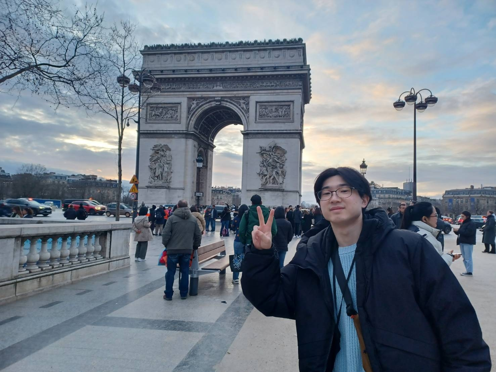

##  プロフィール > [ポートフォリオ](https://j329nish.github.io/Portfolio/)

- 名前：西田祥人（Nishida Shoto）
- 所属：愛媛大学 工学部 工学科 コンピュータ科学コース [人工知能研究室](https://sites.google.com/view/ehime-nlp/) B4
- E-mail：nishida@ai.cs.ehime-u.ac.jp
  
<table align=center>
  <tr>
    <td>
      
    </td>
  </tr>
</table>

##  スキル

| 日付 | 内容 | 使用言語等 | Link |
|-|-|-|-|
| 2024年 2月 | TechFULイベント | `Java` | - |
| 2024年 6月 | クリスマスツリーのライトアップ | `C++` | [Link](https://github.com/j329nish/Wooden_Decoration?tab=readme-ov-file#%E3%82%AF%E3%83%AA%E3%82%B9%E3%83%9E%E3%82%B9%E3%83%84%E3%83%AA%E3%83%BC%E3%81%AE%E3%83%A9%E3%82%A4%E3%83%88%E3%82%A2%E3%83%83%E3%83%97) |
| 2024年 7月 | Webサイトの作成 | `HTML` `PHP` `JavaScript` `SQL` | [Link](https://github.com/j329nish/Web-Programming?tab=readme-ov-file#ウェブプログラミング) |
| 2024年 8月 | Webアプリの作成 | `Java` | [Link](https://github.com/j329nish/Web-Pro_By_Java?tab=readme-ov-file#ウェブプログラミングjava) |
| 2024年 8月 | キッチンタイマー | `C++` | [Link](https://github.com/j329nish/Kitchen-Timer/tree/main?tab=readme-ov-file#%E3%82%AD%E3%83%83%E3%83%81%E3%83%B3%E3%82%BF%E3%82%A4%E3%83%9E%E3%83%BC) |
| 2024年 8月 | インターン | `React` `TypeScript` | - |
| 2025年 3月 | 真贋判定アプリの開発 | `Python` `Streamlit` | [Link](https://github.com/j329nish/Authenticity-check?tab=readme-ov-file#真贋判定アプリauthenticity-check-apps) |
| 2025年 5月 | 自然言語処理100本ノック | `Python` | [Link](https://github.com/j329nish/NLP-100knocks?tab=readme-ov-file#言語処理100本ノック) |
| 2025年 5月 | JoeyNMTの改良 | `Python` | [Link](https://github.com/j329nish/JoeyNMT?tab=readme-ov-file#joeynmt-詳細) |
| 2025年 6月 | 一週間で身につくC++言語の基本 | `C++` `CMake` | [Link](https://github.com/j329nish/Cpp-Sevendays-Study?tab=readme-ov-file#一週間で身につくc言語の基本) |
| 2025年 6月 | ポートフォリオ | `React` `Astro` `TypeScript` | [Link](https://github.com/j329nish/Portfolio?tab=readme-ov-file#ポートフォリオ) |
| 2025年 6月 | 競技プログラミングの鉄則 9.5章まで終了 | `Python` | [Link](https://github.com/j329nish/Kyopro-Tessoku-Book?tab=readme-ov-file#競技プログラミングの鉄則) |
| 2025年 6月 | プログラミング言語のハンズオン | `React` `Python` `Ruby` `C#`   `Go` `C++` `Rust` `Kotlin` | [Link](https://github.com/j329nish/Hands-On?tab=readme-ov-file#hands-on) |
| 2025年 7月 | アノテーションアプリの開発 | `React` `Vite` `Python`   `PostgreSQL` `Render` `Docker` | [Link](https://github.com/BakeryForHackathon/Annotopia) |
| 2025年 8月 | 部屋の人数管理アプリの開発 | `React` `Vite` | [Link](https://github.com/team-barbecue/lab_access_control_app) |
| 2025年 9月 | バイリンガルサブワード分割 | `Python` | [Link](https://github.com/j329nish/Bilingual-Subword-Segmentation) |

 
  
  

## 研究業績

### 国内会議
- 西田祥人, 濱本惇之介, 松浦哉太, 杉原壮一郎, 梶原智之, 二宮　崇, 後藤功雄. 
大規模言語モデルが生成した記事の自動検出. 
情報処理学会第87回全国大会, 6R-06, March 2025. [[URL](https://www.ipsj.or.jp/event/taikai/87/WEB/data/pdf/6R-06.html)] 

- 西田祥人, 二宮　崇, 後藤功雄. 
対訳文対のアライメントを考慮したサブワード分割. 
第20回言語処理若手シンポジウム, S1-P24, September 2025. [[URL](https://yans.anlp.jp/entry/yans2025program)] 

### 受賞等
- 情報処理学会第87回全国大会 学生奨励賞 [[URL](https://www.ipsj.or.jp/award/taikaigakusei.html)]
    > 西田祥人, 濱本惇之介, 松浦哉太, 杉原壮一郎, 梶原智之, 二宮　崇, 後藤功雄. 
    > 大規模言語モデルが生成した記事の自動検出. 
    > 情報処理学会第87回全国大会, 6R-06, March 2025. 

- 愛媛新聞ONLINEに掲載 [[URL](https://www.ehime-np.co.jp/article/news202503120004)]
    > 西田祥人, 濱本惇之介, 松浦哉太, 杉原壮一郎, 梶原智之, 二宮　崇, 後藤功雄. 
    > 大規模言語モデルが生成した記事の自動検出. 
    > 情報処理学会第87回全国大会, 6R-06, March 2025. 

- 愛媛大学工学部工学科コンピュータ科学コース最優秀学生（3 年次）

- 第20回言語処理若手シンポジウム ハッカソン SFT部門 優秀賞

## 経験

- 2024/8  株式会社近計システム 5日間インターン 参加
- 2025/7  技育CAMP2025 ハッカソンVol.8 参加
- 2025/8  Track Job Beginner's Hackathon 参加
- 2025/8  留学生 from マラヤ大学 サポート
- 2025/9  第20回言語処理若手シンポジウム ハッカソン 参加
- 2025/10 SHIN-GS TA

## 資格・趣味

- 2024/6 GPS-Academic 思考力総合Sレベル
- 2025/5 G検定2025#3　合格
- 2025/8 三級知的財産管理技能士(管理業務)
- 2025/8 e-typing　LaserBeam

## ライセンス
このファイルは [MIT License](https://github.com/j329nish/j329nish/blob/main/LICENSE) のもとで公開されています。  

  

    <h1>
        ・・
        ・・
        ・・・・
        ・
        ・・・・
    </h1>

 
